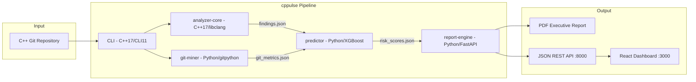

# cppulse

> Point it at any C++ git repository. Get a full technical debt report in under 5 minutes.

<!-- Badges — add after CI is set up on Day 7 -->
<!--  -->
<!--  -->
<!--  -->

## The Problem

<!-- Day 6 task: write this section from your AUMOVIO experience -->
*Coming in Week 1 Day 6...*

## Quickstart

```bash
git clone https://github.com/YOUR_USERNAME/cppulse.git
cd cppulse
REPO_PATH=/path/to/your/cpp/repo docker-compose up
# Dashboard: http://localhost:3000
# PDF report: ./output/report.pdf
```

## What You Get

| Report Section     | What It Shows                                                  |
|--------------------|----------------------------------------------------------------|
| Health Score       | Overall codebase health 0–100, broken down by module           |
| Hotspot Map        | Top 20 files ranked by (change frequency × complexity × debt)  |
| Modernization Hits | Specific C++ patterns to modernize, with line numbers          |
| Knowledge Silos    | Files where only 1 contributor has committed in 12 months      |
| Bug Prediction     | Top 10 files most likely to introduce bugs next (ML-powered)   |
| Refactoring Roadmap| Prioritized list with estimated hours per fix and ROI          |
| MISRA Subset       | 7 high-impact MISRA C++ rules checked                          |
| Trend Tracking     | Sprint-over-sprint health trend graph                          |

## Architecture



## Demo Results

| Repository | LOC | Health Score | Findings | Rules Triggered | Hotspots |
|------------|-----|-------------|----------|-----------------|----------|
| **POCO C++ Libraries** | 640,665 | **55.2/100** | 25,821 | 21/22 | 20 |
| cppulse (self-analysis) | 3,200 | **97.2/100** | 109 | 5/22 | 20 |

### POCO Breakdown

| Category | Score | Findings |
|----------|-------|----------|
| Memory Safety | 92.8/100 | 473 (raw new, delete, C-arrays) |
| Modernization | 33.7/100 | 13,085 (typedef, unscoped enum, C-casts) |
| Complexity | 90.1/100 | 975 (long functions, high cyclomatic) |
| MISRA Compliance | 0.0/100 | 11,288 (uninitialized vars, multiple returns) |

**Top risk files**: `Crypto/src/EVPCipherImpl.cpp`, `Crypto/src/RSACipherImpl.cpp`, `Foundation/include/Poco/Buffer.h`

## Detection Rules (22 total)

| Category | Rules | IDs |
|----------|-------|-----|
| Memory Safety | 3 | CPP-MEM-001–003 (raw new, delete, C-arrays) |
| Modernization | 9 | CPP-MOD-001–009 (C-casts, deprecated headers, missing override, typedef, unscoped enum, ...) |
| Complexity | 3 | CPP-CX-001–003 (cyclomatic complexity, function length, parameter count) |
| MISRA C++ Subset | 7 | MISRA-001–007 (goto, narrowing, union, malloc, recursion, single exit, init vars) |

See [docs/architecture.md](docs/architecture.md) for the full rule table.

## Contributing

Issues and PRs welcome. See [CONTRIBUTING.md](CONTRIBUTING.md) for guidelines.

Built with: libclang · XGBoost · FastAPI · React · Docker
