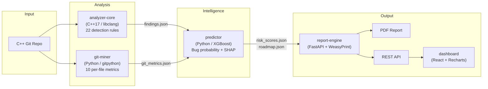
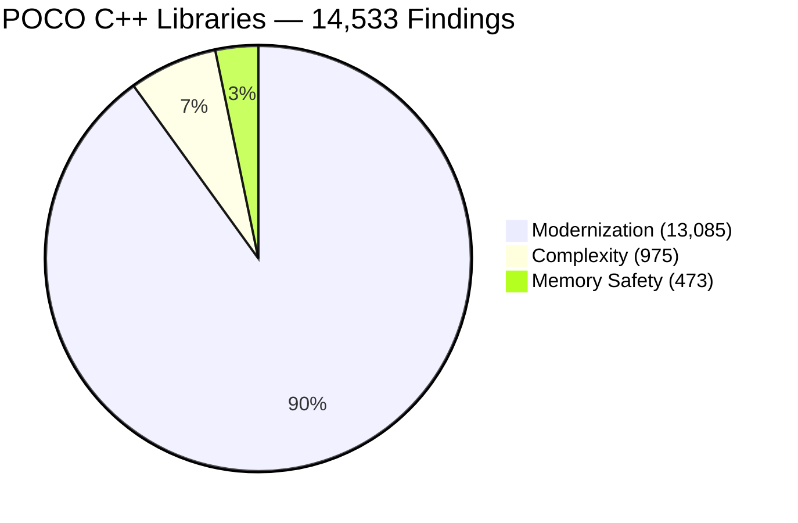

# cppulse

> Point it at any C++ git repository. Get a full technical debt report in under 5 minutes.


## The Problem

Large C++ codebases accumulate technical debt that's invisible until it causes a production incident. Tools like cppcheck and clang-tidy produce thousands of warnings with no prioritization. Nobody knows:
- Which files are most likely to introduce the next bug
- Who is the only person who understands a critical module
- Where to invest refactoring effort for maximum impact

**cppulse answers all three questions** by combining static analysis, git behavioral data, and machine learning into a single health score with a prioritized action plan.

## Proven on Real Codebases

> We analyzed **6 major open-source C++ projects** totaling **2.2M lines of code** — gRPC, POCO, Protocol Buffers, nlohmann/json, fmt, and LevelDB — and found **90,000+ issues** across 15 detection rules.

<!-- LEADERBOARD:START -->
| # | Project | LOC | Health | Findings | Rules | Report |
|--:|---------|----:|:------:|---------:|:-----:|:------:|
| 1 | **gRPC** | 964K | `99.0` ████████████████████ | 9,408 | 15/15 | [Details](examples/grpc/) |
| 2 | **POCO C++ Libraries** | 641K | `97.8` ████████████████████ | 14,533 | 15/15 | [Details](examples/poco/) · [PDF](examples/poco/report.pdf) |
| 3 | **Protocol Buffers** | 400K | `93.8` ███████████████████░ | 63,344 | 15/15 | [Details](examples/protobuf/) |
| 4 | **nlohmann/json** | 98K | `96.8` ███████████████████░ | 618 | 14/15 | [Details](examples/json/) |
| 5 | **fmt** | 54K | `60.9` ████████████░░░░░░░░ | 1,769 | 14/15 | [Details](examples/fmt/) |
| 6 | **LevelDB** | 29K | `76.7` ███████████████░░░░░ | 572 | 12/15 | [Details](examples/leveldb/) |
<!-- LEADERBOARD:END -->

*Run `cppulse analyze --repo /path/to/repo` to analyze your codebase.*

## What You Get

A comprehensive report with 7 sections:

| Section | Description |
|---------|-------------|
| **Health Score** | Single 0-100 number. Memory safety weighted 3x modernization. |
| **Category Breakdown** | Scores for memory safety, modernization, and complexity |
| **Hotspot Map** | Top 20 files by `change_frequency × complexity × debt_density` |
| **Detection Findings** | 15 rules: raw pointers, C-style casts, cyclomatic complexity, ... |
| **Knowledge Silos** | Files where only 1 person has committed in 12 months |
| **Bug Prediction** | Per-file bug probability via XGBoost trained on SZZ-labeled git history |
| **Refactoring Roadmap** | Prioritized fixes with estimated hours and ROI impact score |

## Quickstart

```bash
git clone https://github.com/manju89jay/cppulse.git
cd cppulse

# Analyze any C++ git repository
REPO_PATH=/path/to/your/cpp/repo docker-compose up

# Results:
#   Dashboard  → http://localhost:3000
#   API        → http://localhost:8000/docs
#   PDF Report → ./output/report.pdf
```

Or add cppulse to your CI — see [Action Usage](docs/action-usage.md).

## How It Works



## Detection Rules

15 rules across 3 categories (+ 7 optional MISRA rules for safety-critical projects via `--profile safety-critical`):



<details>
<summary>3 Memory Safety rules (CPP-MEM-001 to 003)</summary>

| ID | Name | Detects |
|----|------|---------|
| CPP-MEM-001 | Raw pointer ownership | `new` without smart pointer wrapping |
| CPP-MEM-002 | Manual memory management | Explicit `delete` / `delete[]` |
| CPP-MEM-003 | Unsafe array access | C-style arrays in function parameters |

</details>

<details>
<summary>9 Modernization rules (CPP-MOD-001 to 009)</summary>

| ID | Name | Detects |
|----|------|---------|
| CPP-MOD-001 | C-style cast | `(int)x` instead of `static_cast` |
| CPP-MOD-002 | Deprecated headers | `<stdio.h>` instead of `<cstdio>` |
| CPP-MOD-003 | Missing override | Virtual method without `override` keyword |
| CPP-MOD-004 | Raw string literal | Strings with excessive escape characters |
| CPP-MOD-005 | auto opportunity | Verbose type declarations where `auto` is clearer |
| CPP-MOD-006 | Range-for opportunity | Index-based loops that could use range-for |
| CPP-MOD-007 | nullptr vs NULL | Use of `NULL` macro or `0` for null pointers |
| CPP-MOD-008 | Unscoped enum | `enum` without `class` keyword |
| CPP-MOD-009 | typedef vs using | `typedef` instead of `using` alias |

</details>

<details>
<summary>3 Complexity rules (CPP-CX-001 to 003)</summary>

| ID | Name | Threshold |
|----|------|-----------|
| CPP-CX-001 | Cyclomatic complexity | > 15 warning, > 25 error |
| CPP-CX-002 | Function length | > 80 lines warning, > 150 error |
| CPP-CX-003 | Parameter count | > 5 warning, > 8 error |

</details>

<details>
<summary>7 MISRA C++ rules (MISRA-001 to 007) — opt-in via --profile safety-critical</summary>

| ID | Name | MISRA Rule |
|----|------|------------|
| MISRA-001 | No goto | Rule 6.6.2 |
| MISRA-002 | No implicit narrowing | Rule 7.0.2 |
| MISRA-003 | No union | Rule 12.3.1 |
| MISRA-004 | No dynamic allocation | Rule 21.6.1 |
| MISRA-005 | No recursion | Rule 17.2.1 |
| MISRA-006 | Single exit point | Rule 15.5.1 |
| MISRA-007 | Initialize all variables | Rule 8.1.1 |

</details>

## Architecture

See [docs/architecture.md](docs/architecture.md) for the full system design.

## CI Integration

Add cppulse to any C++ project's CI in 2 minutes:

```yaml
- uses: manju89jay/cppulse/.github/actions/cppulse@main
  with:
    post-comment: 'true'
```

See [docs/action-usage.md](docs/action-usage.md) for full configuration.

## Contributing

Issues and PRs welcome. See [CONTRIBUTING.md](CONTRIBUTING.md) for guidelines.

---

Built with: libclang · XGBoost · FastAPI · React · Docker
