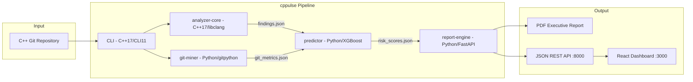

# cppulse

> Point it at any C++ git repository. Get a full technical debt report in under 5 minutes.

<!-- Badges — add after CI is set up on Day 7 -->
<!--  -->
<!--  -->
<!--  -->

## The Problem

<!-- Day 6 task: write this section from your AUMOVIO experience -->
*Coming in Week 1 Day 6...*

## Quickstart

```bash
git clone https://github.com/YOUR_USERNAME/cppulse.git
cd cppulse
REPO_PATH=/path/to/your/cpp/repo docker-compose up
# Dashboard: http://localhost:3000
# PDF report: ./output/report.pdf
```

## What You Get

| Report Section     | What It Shows                                                  |
|--------------------|----------------------------------------------------------------|
| Health Score       | Overall codebase health 0–100, broken down by module           |
| Hotspot Map        | Top 20 files ranked by (change frequency × complexity × debt)  |
| Modernization Hits | Specific C++ patterns to modernize, with line numbers          |
| Knowledge Silos    | Files where only 1 contributor has committed in 12 months      |
| Bug Prediction     | Top 10 files most likely to introduce bugs next (ML-powered)   |
| Refactoring Roadmap| Prioritized list with estimated hours per fix and ROI          |
| MISRA Subset       | 7 high-impact MISRA C++ rules checked                          |
| Trend Tracking     | Sprint-over-sprint health trend graph                          |

## Architecture



## Demo Results

<!-- Week 4+: add real results here -->
| Repository | LOC    | Findings | Knowledge Silos | Analysis Time |
|------------|--------|----------|-----------------|---------------|
| *Coming Week 4 — POCO C++ Libraries* | | | | |
| *Coming Week 6 — OpenCV* | | | | |
| *Coming Week 6 — Godot Engine* | | | | |

## Detection Rules (22 total)

<!-- Week 2: update with real rule descriptions -->
**Memory Safety** · **Modernization** · **Complexity** · **MISRA C++ Subset**

See [docs/architecture.md](docs/architecture.md) for the full rule table.

## Contributing

Issues and PRs welcome. See [CONTRIBUTING.md](CONTRIBUTING.md) for guidelines.

Built with: libclang · XGBoost · FastAPI · React · Docker
