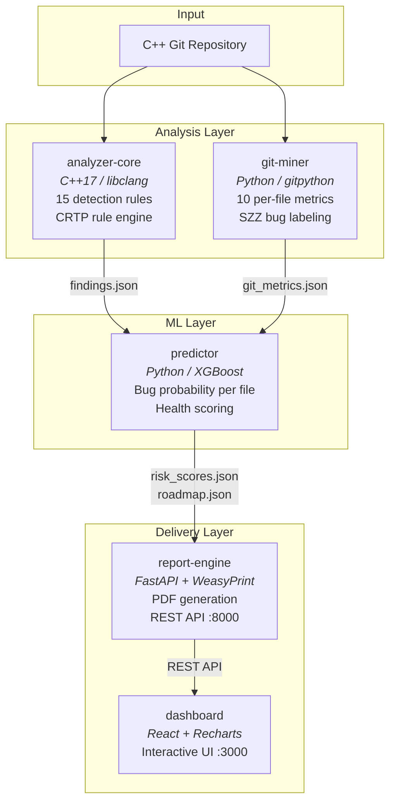
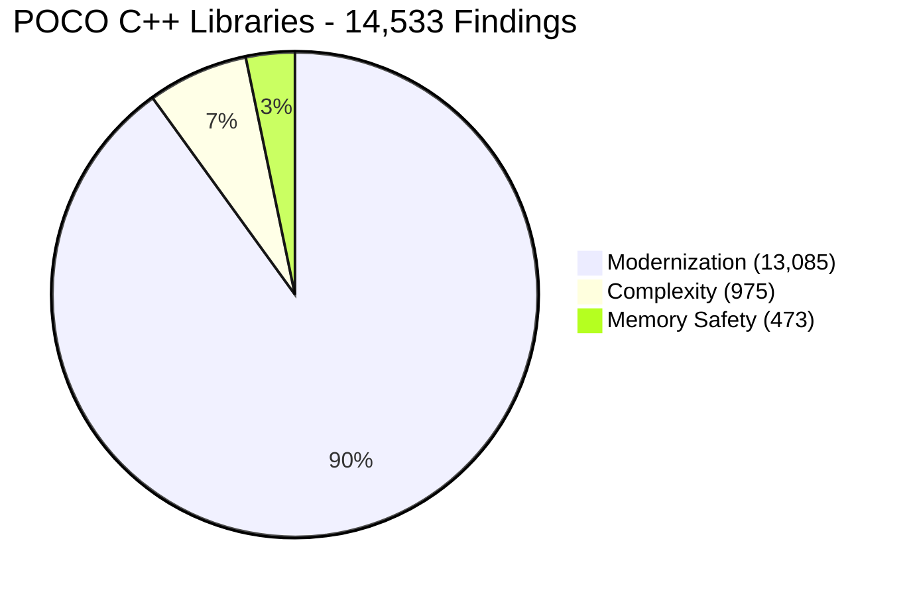

# cppulse

**C++ codebase health analyzer** — combines static analysis, git behavioral mining, and machine learning to generate prioritized technical debt reports.

Point it at any C++ git repository. Get a health score, bug predictions, knowledge silo alerts, and a refactoring roadmap.


## Why cppulse?

Static analysis tools like cppcheck and clang-tidy produce thousands of warnings with no prioritization. cppulse answers three questions they can't:

1. **Which files are most likely to introduce the next bug?** — XGBoost model trained on SZZ-labeled git history
2. **Who is the only person who understands a critical module?** — Knowledge silo detection from 12-month authorship analysis
3. **Where should refactoring effort go first?** — Prioritized roadmap ranked by risk, severity, and estimated hours

## Quickstart

```bash
git clone https://github.com/manju89jay/cppulse.git
cd cppulse

# Analyze any C++ git repository
REPO_PATH=/path/to/your/cpp/repo docker-compose up

# Results:
#   Dashboard  -> http://localhost:3000
#   REST API   -> http://localhost:8000/docs
#   PDF Report -> ./output/report.pdf
```

## Architecture

Six components communicate exclusively via JSON artifacts written to `./output/`. No shared state, no tight coupling ([ADR-004](docs/adr/ADR-004-json-comms.md)).



### Data Flow

| Step | Component | Input | Output |
|-----:|-----------|-------|--------|
| 1 | **analyzer-core** | C++ source files | `findings.json` — violations from 15 AST rules |
| 2 | **git-miner** | git log | `git_metrics.json` — 10 behavioral metrics per file |
| 3 | **predictor** | both JSONs | `risk_scores.json` + `roadmap.json` |
| 4 | **report-engine** | all JSONs | PDF report + REST API on :8000 |
| 5 | **dashboard** | REST API | Interactive visualization on :3000 |

### Component Stack

| Component | Language | Key Libraries |
|-----------|----------|---------------|
| [analyzer-core](analyzer-core/) | C++17 | libclang, nlohmann/json, spdlog |
| [git-miner](git-miner/) | Python | gitpython, pandas |
| [predictor](predictor/) | Python | xgboost, scikit-learn, pandas |
| [report-engine](report-engine/) | Python | FastAPI, Jinja2, WeasyPrint |
| [dashboard](dashboard/) | TypeScript | React, Recharts, Tailwind CSS |
| [cli](cli/) | C++17 | CLI11, spdlog |

## What You Get

A report with 7 sections:

| Section | What It Tells You |
|---------|-------------------|
| **Health Score** | Single 0-100 number. Memory safety weighted 3x. |
| **Category Breakdown** | Per-category scores: memory safety, modernization, complexity |
| **Hotspot Map** | Top 20 files by change_frequency x complexity x debt_density |
| **Detection Findings** | Per-file violations across 15 rules (22 with `--profile safety-critical`) |
| **Knowledge Silos** | Files where only 1 person has committed in 12 months |
| **Bug Prediction** | Per-file bug probability via XGBoost trained on SZZ-labeled history |
| **Refactoring Roadmap** | Prioritized fixes with estimated hours and ROI impact score |

## Proven on Real Codebases

Analyzed **6 major open-source C++ projects** totaling **2.2M lines of code**:

<!-- LEADERBOARD:START -->
| # | Project | LOC | Health | Findings | Rules | Report |
|--:|---------|----:|:------:|---------:|:-----:|:------:|
| 1 | **gRPC** | 964K | `99.0` ████████████████████ | 9,408 | 15/15 | [Details](examples/grpc/) |
| 2 | **POCO C++ Libraries** | 641K | `97.8` ████████████████████ | 14,533 | 15/15 | [Details](examples/poco/) · [PDF](examples/poco/report.pdf) |
| 3 | **Protocol Buffers** | 400K | `93.8` ███████████████████░ | 63,344 | 15/15 | [Details](examples/protobuf/) |
| 4 | **nlohmann/json** | 98K | `96.8` ███████████████████░ | 618 | 14/15 | [Details](examples/json/) |
| 5 | **fmt** | 54K | `60.9` ████████████░░░░░░░░ | 1,769 | 14/15 | [Details](examples/fmt/) |
| 6 | **LevelDB** | 29K | `76.7` ███████████████░░░░░ | 572 | 12/15 | [Details](examples/leveldb/) |
<!-- LEADERBOARD:END -->

## Detection Rules

15 default rules across 3 categories, plus 7 optional MISRA C++ rules:



<details>
<summary><b>Memory Safety</b> (3 rules, 3.0x weight)</summary>

| ID | Rule | Detects |
|----|------|---------|
| CPP-MEM-001 | Raw pointer ownership | `new` without smart pointer wrapping |
| CPP-MEM-002 | Manual memory management | Explicit `delete` / `delete[]` |
| CPP-MEM-003 | Unsafe array access | C-style arrays in function parameters |

</details>

<details>
<summary><b>Modernization</b> (9 rules, 1.0x weight)</summary>

| ID | Rule | Detects |
|----|------|---------|
| CPP-MOD-001 | C-style cast | `(int)x` instead of `static_cast` |
| CPP-MOD-002 | Deprecated headers | `<stdio.h>` instead of `<cstdio>` |
| CPP-MOD-003 | Missing override | Virtual method without `override` |
| CPP-MOD-004 | Raw string literal | Strings with excessive escaping |
| CPP-MOD-005 | auto opportunity | Verbose type declarations |
| CPP-MOD-006 | Range-for opportunity | Index-based loops |
| CPP-MOD-007 | nullptr vs NULL | Use of `NULL` macro |
| CPP-MOD-008 | Unscoped enum | `enum` without `class` |
| CPP-MOD-009 | typedef vs using | `typedef` instead of `using` |

</details>

<details>
<summary><b>Complexity</b> (3 rules, 1.5x weight)</summary>

| ID | Rule | Threshold |
|----|------|-----------|
| CPP-CX-001 | Cyclomatic complexity | warn > 15, error > 25 |
| CPP-CX-002 | Function length | warn > 80 lines, error > 150 |
| CPP-CX-003 | Parameter count | warn > 5, error > 8 |

</details>

<details>
<summary><b>MISRA C++</b> (7 rules, 2.5x weight) -- opt-in via <code>--profile safety-critical</code></summary>

| ID | Rule | Based On |
|----|------|----------|
| MISRA-001 | No goto | Rule 6.6.2 |
| MISRA-002 | No implicit narrowing | Rule 7.0.2 |
| MISRA-003 | No union | Rule 12.3.1 |
| MISRA-004 | No dynamic allocation | Rule 21.6.1 |
| MISRA-005 | No recursion | Rule 17.2.1 |
| MISRA-006 | Single exit point | Rule 15.5.1 |
| MISRA-007 | Initialize all variables | Rule 8.1.1 |

</details>

## Health Score

Penalty-based model where each category contributes a weighted penalty based on findings density (findings per KLOC):

```
health = 100 - weighted_average(
    penalty(memory_safety)  * 3.0,
    penalty(complexity)     * 1.5,
    penalty(modernization)  * 1.0
)
```

The safety-critical profile adds MISRA at 2.5x weight. A codebase with zero findings scores 100.

## CI Integration

Add cppulse to any C++ project's CI pipeline:

```yaml
- uses: manju89jay/cppulse/.github/actions/cppulse@main
  with:
    post-comment: 'true'
```

See [docs/action-usage.md](docs/action-usage.md) for full configuration options.

## Development

### Prerequisites

- C++17 compiler (GCC 9+, Clang 10+, MSVC 2019+)
- CMake 3.16+
- Python 3.11+
- Node.js 18+
- Docker & Docker Compose (for full-stack runs)

### Building

```bash
# C++ components
cd analyzer-core && cmake -B build && cmake --build build
cd ../cli && cmake -B build && cmake --build build

# Python components
pip install -r git-miner/requirements.txt
pip install -r predictor/requirements.txt
pip install -r report-engine/requirements.txt

# Dashboard
cd dashboard && npm ci && npm run build
```

### Compilation database

analyzer-core looks for `compile_commands.json` in the analyzed repo root (or its
`build/` directory) and parses each file with its recorded include paths, defines,
and language standard — falling back to bare `-std=c++17` when absent. Generate one
with `cmake -DCMAKE_EXPORT_COMPILE_COMMANDS=ON` for substantially more accurate
type-dependent findings; the log reports how many files used recorded args.

### Testing

```bash
# C++ tests (GoogleTest)
cd analyzer-core/build && ctest --output-on-failure

# Python tests (pytest)
cd git-miner && pytest -v --cov=src tests/
cd predictor && pytest -v --cov=src tests/
cd report-engine && pytest -v --cov=src tests/

# Full stack
docker-compose up --build
```

### Linting

```bash
clang-tidy analyzer-core/src/*.cpp -- -std=c++17
ruff check . && black --check .
```

## Architecture Decisions

| ADR | Decision | Rationale |
|-----|----------|-----------|
| [ADR-001](docs/adr/ADR-001-libclang.md) | Use libclang for AST analysis | Mature API, handles macros and templates correctly |
| [ADR-002](docs/adr/ADR-002-xgboost.md) | XGBoost for bug prediction | Interpretable, works on small datasets, no GPU needed |
| [ADR-003](docs/adr/ADR-003-monorepo.md) | Monorepo layout | Atomic changes across components, shared CI |
| [ADR-004](docs/adr/ADR-004-json-comms.md) | JSON for inter-component data | Schema-validated, human-readable, component isolation |
| [ADR-005](docs/adr/ADR-005-pdf-report.md) | WeasyPrint for PDF generation | CSS-based layout, Python-native, no external dependencies |

## Project Structure

```
cppulse/
  analyzer-core/    C++17 static analysis engine (libclang)
  git-miner/        Python git history analyzer
  predictor/        Python ML pipeline (XGBoost)
  report-engine/    FastAPI REST API + PDF generation
  dashboard/        React + TypeScript interactive UI
  cli/              C++17 CLI orchestrator
  docs/             ADRs, schemas, specs
  examples/         Showcase analyses of real C++ projects
```

## License

[MIT](LICENSE)

---

Built with libclang, XGBoost, FastAPI, React, and Docker.
