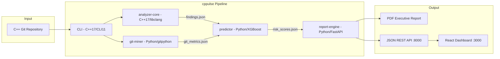

# cppulse

> Point it at any C++ git repository. Get a full technical debt report in under 5 minutes.


## The Problem

Large C++ codebases accumulate technical debt silently. Existing tools like `cppcheck` and `clang-tidy` give you thousands of individual warnings — but no health score, no prioritized roadmap, and no answer to the question: *which file will cause the next production bug?*

cppulse combines **static analysis** (22 rules via libclang), **git behavioral analysis** (change frequency, knowledge silos, code churn), and **ML-powered bug prediction** (XGBoost) to produce a single actionable report: a 0-100 health score, a prioritized refactoring roadmap, and per-file bug probability predictions.

## Analyzed Codebases

> cppulse has been run against these real-world open-source C++ projects.
> Click any project to see category breakdowns, risk files, and refactoring roadmap.

<!-- LEADERBOARD:START -->
| # | Project | LOC | Health | Findings | Rules | Report |
|--:|---------|----:|:------:|---------:|:-----:|:------:|
| 1 | **POCO C++ Libraries** | 641K | `55.2` ███████████░░░░░░░░░ | 25,821 | 21/22 | [Details](examples/poco/) · [PDF](examples/poco/report.pdf) |
<!-- LEADERBOARD:END -->

*Run `cppulse analyze --repo /path/to/repo` to add your project.*

## What You Get

| Report Section      | What It Shows |
|---------------------|---------------|
| **Health Score**     | Overall codebase health 0-100, broken down by 4 categories |
| **Hotspot Map**      | Top 20 files ranked by change frequency x complexity x debt density |
| **Detection Findings** | 22 rules across memory safety, modernization, complexity, and MISRA C++ |
| **Knowledge Silos**  | Files where only 1 contributor has committed in 12 months |
| **Bug Prediction**   | Top 10 files most likely to introduce bugs next (XGBoost + SHAP) |
| **Refactoring Roadmap** | Prioritized fixes with estimated hours and ROI impact score |
| **PDF Report**       | 272-page executive report generated by WeasyPrint |

## Quickstart

```bash
git clone https://github.com/manju89jay/cppulse.git
cd cppulse
REPO_PATH=/path/to/your/cpp/repo docker-compose up
# Dashboard: http://localhost:3000
# API:       http://localhost:8000/docs
# PDF:       ./output/report.pdf
```

## How It Works



## Detection Rules (22)

<details>
<summary>3 Memory Safety rules (CPP-MEM-001 to 003)</summary>

| ID | Name | Detects |
|----|------|---------|
| CPP-MEM-001 | Raw pointer ownership | `new` without smart pointer wrapping |
| CPP-MEM-002 | Manual memory management | Explicit `delete` / `delete[]` |
| CPP-MEM-003 | Unsafe array access | C-style arrays in function parameters |

</details>

<details>
<summary>9 Modernization rules (CPP-MOD-001 to 009)</summary>

| ID | Name | Detects |
|----|------|---------|
| CPP-MOD-001 | C-style cast | `(int)x` instead of `static_cast` |
| CPP-MOD-002 | Deprecated headers | `<stdio.h>` instead of `<cstdio>` |
| CPP-MOD-003 | Missing override | Virtual method without `override` keyword |
| CPP-MOD-004 | Raw string literal | Strings with excessive escape characters |
| CPP-MOD-005 | auto opportunity | Verbose type declarations where `auto` is clearer |
| CPP-MOD-006 | Range-for opportunity | Index-based loops that could use range-for |
| CPP-MOD-007 | nullptr vs NULL | Use of `NULL` macro or `0` for null pointers |
| CPP-MOD-008 | Unscoped enum | `enum` without `class` keyword |
| CPP-MOD-009 | typedef vs using | `typedef` instead of `using` alias |

</details>

<details>
<summary>3 Complexity rules (CPP-CX-001 to 003)</summary>

| ID | Name | Threshold |
|----|------|-----------|
| CPP-CX-001 | Cyclomatic complexity | > 15 warning, > 25 error |
| CPP-CX-002 | Function length | > 80 lines warning, > 150 error |
| CPP-CX-003 | Parameter count | > 5 warning, > 8 error |

</details>

<details>
<summary>7 MISRA C++ rules (MISRA-001 to 007)</summary>

| ID | Name | MISRA Rule |
|----|------|------------|
| MISRA-001 | No goto | Rule 6.6.2 |
| MISRA-002 | No implicit narrowing | Rule 7.0.2 |
| MISRA-003 | No union | Rule 12.3.1 |
| MISRA-004 | No dynamic allocation | Rule 21.6.1 |
| MISRA-005 | No recursion | Rule 17.2.1 |
| MISRA-006 | Single exit point | Rule 15.5.1 |
| MISRA-007 | Initialize all variables | Rule 8.1.1 |

</details>

## Contributing

Issues and PRs welcome. See [CONTRIBUTING.md](CONTRIBUTING.md) for guidelines.

Built with: libclang · XGBoost · FastAPI · React · Docker
