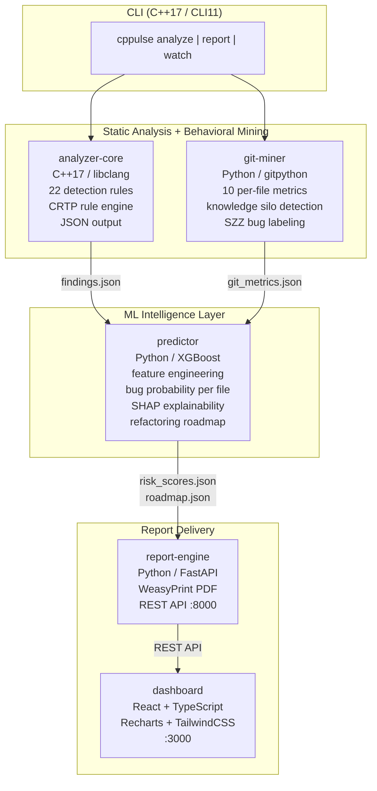
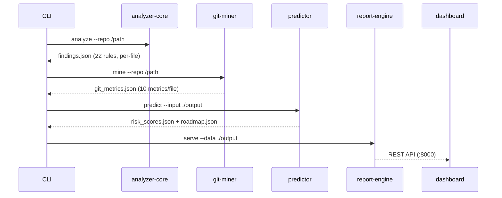

# cppulse Architecture

## System Overview



## Pipeline Data Flow

Six deterministic steps transform a raw C++ repository into an actionable report.
Each step writes a validated JSON artifact that the next step reads — no shared
state, no tight coupling (ADR-004).



### Step-by-step

| Step | Component | Input | Output | Key Work |
|-----:|-----------|-------|--------|----------|
| 1 | CLI | repo path | — | Validates target is a C++ git repo |
| 2 | analyzer-core | source files | `findings.json` | Runs 22 libclang rules; emits per-file violation list |
| 3 | git-miner | git log | `git_metrics.json` | Computes 10 behavioral metrics; detects knowledge silos |
| 4 | predictor | both JSONs | `risk_scores.json`, `roadmap.json` | Merges features; trains XGBoost; applies SZZ labels; ranks fixes |
| 5 | report-engine | all JSONs | `report.pdf`, REST API | Renders PDF via WeasyPrint; serves FastAPI endpoints |
| 6 | dashboard | REST API | interactive UI | React + Recharts visualization on :3000 |

## Component Responsibilities

| Component | Language | Responsibility | Key Libraries |
|-----------|----------|----------------|---------------|
| `analyzer-core` | C++17 | AST-level static analysis via libclang; 22 rules in a CRTP rule engine | libclang, nlohmann/json, spdlog |
| `git-miner` | Python | Git log mining: change frequency, churn, authorship entropy, silo detection | gitpython, pandas, numpy |
| `predictor` | Python | Feature engineering, XGBoost training, SZZ bug labeling, SHAP explainability, roadmap generation | xgboost, scikit-learn, shap, pandas |
| `report-engine` | Python | FastAPI REST layer; Jinja2 HTML templating; WeasyPrint PDF generation | fastapi, uvicorn, jinja2, weasyprint |
| `dashboard` | TypeScript / React | Interactive health dashboard: score gauges, hotspot treemap, silo alerts, bug predictions | recharts, tailwindcss, vite |
| `cli` | C++17 | Orchestration: invokes components in order, validates JSON handoffs, streams progress | CLI11, fmt, nlohmann/json |

## Detection Rules (22 total)

All rules are implemented in `analyzer-core` using a CRTP rule engine that walks
the libclang AST. Each rule emits findings with file path, line number, severity,
and an estimated remediation time used by the refactoring roadmap.

| Category | Count | IDs | Weight in Health Score |
|----------|------:|-----|------------------------|
| Memory Safety | 3 | CPP-MEM-001 – CPP-MEM-003 | 3.0x |
| Modernization | 9 | CPP-MOD-001 – CPP-MOD-009 | 1.0x |
| Complexity | 3 | CPP-CX-001 – CPP-CX-003 | 1.5x |
| MISRA C++ Subset | 7 | MISRA-001 – MISRA-007 | 2.5x |

### Memory Safety (CPP-MEM-001 – 003)

Raw pointer ownership, manual `delete`/`delete[]`, C-style array parameters.
Findings in this category are the strongest predictor of production crashes and
are therefore weighted 3x in the health score.

### Modernization (CPP-MOD-001 – 009)

C-style casts, deprecated C headers, missing `override`, NULL vs. nullptr,
unscoped enums, `typedef` vs `using`, range-for and `auto` opportunities.

### Complexity (CPP-CX-001 – 003)

Cyclomatic complexity (warning > 15, error > 25), function length (warning > 80
lines, error > 150), and parameter count (warning > 5, error > 8).

### MISRA C++ Subset (MISRA-001 – 007)

`goto`, implicit narrowing conversions, `union`, dynamic allocation, recursion,
multiple return points, uninitialized variables. Grounded in MISRA C++:2023 and
AUTOSAR C++14.

## Health Score Algorithm

The health score is a 0–100 penalty model. Each category contributes a weighted
penalty based on its findings density (findings per KLOC):

```
penalty(category) = min(findings / kloc / threshold, 1.0)

weighted_penalty = (
    penalty(memory_safety)  × 3.0 +
    penalty(misra)          × 2.5 +
    penalty(complexity)     × 1.5 +
    penalty(modernization)  × 1.0
) / (3.0 + 2.5 + 1.5 + 1.0)

health_score = round((1.0 - weighted_penalty) × 100, 1)
```

A codebase with zero findings scores 100. The memory safety weight (3x) reflects
the empirical finding that raw pointer violations are the dominant source of
CVEs and crash bugs in production C++ systems.

**POCO C++ Libraries result:** 55.2/100 — MISRA compliance (score 0.0) and
modernization debt (score 33.7) drag the overall score despite strong memory
safety (92.8) and complexity (90.1) numbers.

## Inter-Component Communication

All components communicate exclusively via JSON files written to `./output/`.
There is no in-process coupling between components; each can be run independently
or replaced without affecting the others (ADR-004).

| File | Writer | Readers | Schema |
|------|--------|---------|--------|
| `output/findings.json` | analyzer-core | predictor, report-engine | `docs/schemas/findings.schema.json` |
| `output/git_metrics.json` | git-miner | predictor, report-engine | `docs/schemas/git_metrics.schema.json` |
| `output/risk_scores.json` | predictor | report-engine, dashboard | `docs/schemas/risk_scores.schema.json` |
| `output/roadmap.json` | predictor | report-engine, dashboard | `docs/schemas/roadmap.schema.json` |

Each component validates its input JSON against the published schema before
processing. A schema validation failure halts the pipeline with a clear error
message rather than producing a silently corrupt report.

## Port Map

| Service | Port | URL |
|---------|------|-----|
| report-engine REST API | 8000 | `http://localhost:8000` |
| Swagger / OpenAPI docs | 8000 | `http://localhost:8000/docs` |
| React dashboard | 3000 | `http://localhost:3000` |
