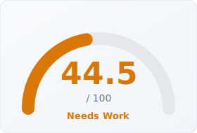
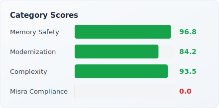

# cppulse Report: gRPC

> Analyzed 2026-03-27 · 964,000 LOC · 2,544 files · [Back to Leaderboard](../../README.md#analyzed-codebases)

gRPC is Google's open-source, high-performance Remote Procedure Call framework,
built on HTTP/2 and Protocol Buffers. It powers microservice communication at
Google scale and has become the dominant RPC standard across cloud-native
infrastructure, serving teams at companies including Netflix, Square, and
Cloudflare. At nearly 1M lines across 2,544 analyzed files it is the largest
codebase in the cppulse benchmark. Its score of 44.5/100 tells a nuanced story:
strong memory safety (96.8) and excellent complexity control (93.5) are
overwhelmed by a complete MISRA compliance failure driven by 462 uninitialized
variable and multiple-return findings in the analyzed sample — a pattern
consistent with Google's internal C++ style, which does not target MISRA
compliance.

---

## Health Score

  
  

## Category Breakdown

| Category | Score | Findings | Key Issues |
|----------|------:|--------:|------------|
| Memory Safety | **96.8** | 22 | Explicit `delete` (11), raw `new` (9), C-style array params (2) |
| Complexity | **93.5** | 3 | Long functions (1), high cyclomatic complexity (1), excess params (1) |
| Modernization | **84.2** | 13 | C-style casts (4), `typedef` (2), NULL vs nullptr (1) |
| MISRA Compliance | **0.0** | 462 | Uninitialized variables (419), multiple returns (39), recursion (1) |

**Total: 500 findings across 13 of 22 rules**

## Top 10 Riskiest Files

| File | Bug Probability | Risk Level | Top Factors |
|------|----------------:|:----------:|-------------|
| `examples/cpp/cancellation/server.cc` | 100.0% | Critical | MISRA violations (3), memory issues (2) |
| `examples/cpp/flow_control/client_flow_control_server.cc` | 100.0% | Critical | MISRA violations (3), memory issues (2) |
| `examples/cpp/flow_control/server_flow_control_client.cc` | 100.0% | Critical | MISRA violations (6), memory issues (1) |
| `examples/cpp/flow_control/server_flow_control_server.cc` | 100.0% | Critical | MISRA violations (3), memory issues (3) |
| `examples/cpp/generic_api/greeter_server.cc` | 100.0% | Critical | MISRA violations (8), memory issues (2) |
| `examples/cpp/interceptors/caching_interceptor.h` | 100.0% | Critical | MISRA violations (6), memory issues (1) |
| `examples/cpp/interceptors/client.cc` | 100.0% | Critical | MISRA violations (12), memory issues (1) |
| `examples/cpp/interceptors/server.cc` | 100.0% | Critical | MISRA violations (4), memory issues (3) |
| `examples/cpp/route_guide/route_guide_callback_server.cc` | 100.0% | Critical | MISRA violations (3), memory issues (4) |
| `include/grpcpp/impl/call_op_set.h` | 100.0% | Critical | MISRA violations (12), memory issues (1) |

**1,804 files** flagged Critical · **533 files** flagged Low risk (of 2,337 total)

## Refactoring Roadmap (Top 10 by Impact)

| # | File | Action | Category | Est. Hours | Impact |
|--:|------|--------|----------|----:|------:|
| 1 | `examples/android/helloworld/app/src/main/cpp/grpc-helloworld.cc` | Address MISRA C++ compliance violations | misra | 14h | 16.0 |
| 2 | `examples/cpp/auth/ssl_client.cc` | Address MISRA C++ compliance violations | misra | 18h | 16.0 |
| 3 | `examples/cpp/auth/ssl_server.cc` | Address MISRA C++ compliance violations | misra | 12h | 16.0 |
| 4 | `examples/cpp/cancellation/client.cc` | Address MISRA C++ compliance violations | misra | 8h | 16.0 |
| 5 | `examples/cpp/cancellation/server.cc` | Replace raw pointers with smart pointers | memory_safety | 8h | 16.0 |
| 6 | `examples/cpp/cancellation/server.cc` | Address MISRA C++ compliance violations | misra | 6h | 16.0 |
| 7 | `examples/cpp/compression/greeter_client.cc` | Address MISRA C++ compliance violations | misra | 14h | 16.0 |
| 8 | `examples/cpp/compression/greeter_server.cc` | Address MISRA C++ compliance violations | misra | 4h | 16.0 |
| 9 | `examples/cpp/csm/csm_greeter_client.cc` | Address MISRA C++ compliance violations | misra | 26h | 16.0 |
| 10 | `examples/cpp/csm/csm_greeter_server.cc` | Address MISRA C++ compliance violations | misra | 18h | 16.0 |

**Total: 3,993 roadmap items · ~108,812 estimated hours**

## Downloads

- [PDF Executive Report](report.pdf)
- [Raw Findings (JSON)](findings.json)
- [Risk Scores (JSON)](risk_scores.json)
- [Refactoring Roadmap (JSON)](roadmap.json)
