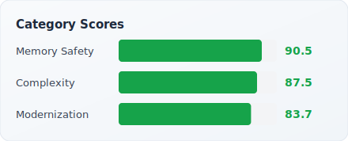

# cppulse Report: nlohmann/json

> Analyzed 2026-03-27 · 98,000 LOC · 479 files · [Back to Leaderboard](../../README.md#analyzed-codebases)

nlohmann/json is the most widely starred C++ JSON library on GitHub, created by
Niels Lohmann. Its single-header design, intuitive API, and comprehensive test
suite have made it the de facto standard for JSON handling in modern C++ projects
across game engines, scientific computing, and cloud services.
cppulse scores it at 96.8/100 — reflecting strong memory safety (95.8), complexity control (90.9), modernization (94.8).

---

## Health Score

  
  

## Category Breakdown

| Category | Score | Findings | Key Issues |
|----------|------:|--------:|------------|
| Memory Safety | **95.8** | 64 | Raw `new` (15), explicit `delete` (5), C-style array params (2) |
| Complexity | **90.9** | 114 | high cyclomatic complexity (32), long functions (31), too many params (9) |
| Modernization | **94.8** | 440 | `typedef` (21), C-style casts (19), `auto` opportunities (12) |

**Total: 618 findings across 14 of 15 rules**

## Top 10 Riskiest Files

| File | Bug Probability | Risk Level | Top Factors |
|------|----------------:|:----------:|-------------|
| `docs/mkdocs/docs/examples/get_to.cpp` | 99.4% | Critical | 5 total findings |
| `include/nlohmann/detail/iterators/iter_impl.hpp` | 99.4% | Critical | 5 total findings |
| `include/nlohmann/detail/json_pointer.hpp` | 99.4% | Critical | 6 total findings |
| `include/nlohmann/ordered_map.hpp` | 99.4% | Critical | 10 total findings |
| `tests/src/unit-bson.cpp` | 99.4% | Critical | 3 total findings |
| `tests/src/unit-cbor.cpp` | 99.4% | Critical | 3 total findings |
| `tests/src/unit-class_parser.cpp` | 99.4% | Critical | 13 total findings |
| `tests/src/unit-class_parser_diagnostic_positions.cpp` | 99.4% | Critical | 12 total findings |
| `tests/src/unit-msgpack.cpp` | 99.4% | Critical | 3 total findings |
| `tests/src/unit-testsuites.cpp` | 99.4% | Critical | 2 total findings |

**47 files** flagged Critical · **2 files** flagged High · **2 files** flagged Medium · **28 files** flagged Low risk (of 79 total)

## Refactoring Roadmap (Top 10 by Impact)

| # | File | Action | Category | Est. Hours | Impact |
|--:|------|--------|----------|----:|------:|
| 1 | `include/nlohmann/detail/conversions/to_chars.hpp` | Reduce cyclomatic complexity by extracting methods and simplifying control flow | complexity | 15h | 12.0 |
| 2 | `include/nlohmann/detail/input/binary_reader.hpp` | Reduce cyclomatic complexity by extracting methods and simplifying control flow | complexity | 66h | 12.0 |
| 3 | `include/nlohmann/detail/input/lexer.hpp` | Reduce cyclomatic complexity by extracting methods and simplifying control flow | complexity | 21h | 12.0 |
| 4 | `include/nlohmann/json.hpp` | Reduce cyclomatic complexity by extracting methods and simplifying control flow | complexity | 24h | 12.0 |
| 5 | `include/nlohmann/detail/output/binary_writer.hpp` | Reduce cyclomatic complexity by extracting methods and simplifying control flow | complexity | 33h | 12.0 |
| 6 | `include/nlohmann/detail/output/serializer.hpp` | Reduce cyclomatic complexity by extracting methods and simplifying control flow | complexity | 12h | 12.0 |
| 7 | `tests/src/unit-bjdata.cpp` | Reduce cyclomatic complexity by extracting methods and simplifying control flow | complexity | 3h | 12.0 |
| 8 | `tests/thirdparty/Fuzzer/FuzzerDriver.cpp` | Reduce cyclomatic complexity by extracting methods and simplifying control flow | complexity | 12h | 12.0 |
| 9 | `tests/src/unit-udt_macro.cpp` | Reduce cyclomatic complexity by extracting methods and simplifying control flow | complexity | 6h | 9.0 |
| 10 | `docs/mkdocs/docs/examples/at__json_pointer.cpp` | Reduce cyclomatic complexity by extracting methods and simplifying control flow | complexity | 3h | 8.0 |

**Total: 60 roadmap items · ~387 estimated hours**

## Downloads

- [PDF Executive Report](report.pdf)
- [Raw Findings (JSON)](findings.json)
- [Risk Scores (JSON)](risk_scores.json)
- [Refactoring Roadmap (JSON)](roadmap.json)
