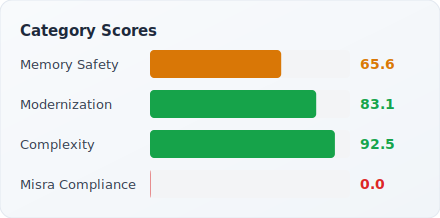

# cppulse Report: LevelDB

> Analyzed 2026-06-12 · 28,648 LOC · 132 files · [Back to Leaderboard](../../README.md#analyzed-codebases)

LevelDB is Google's fast on-disk key-value storage library, originally written by Jeff Dean and Sanjay Ghemawat and open-sourced in 2011. It underpins Chrome's IndexedDB and has been adopted by Bitcoin Core, Ethereum clients, and dozens of embedded database projects.
cppulse scores it at 18.9/100 — reflecting strong memory safety (0.0), complexity (63.7), modernization (8.2).

---

## Health Score

  
  

## Category Breakdown

| Category | Score | Findings | Key Issues |
|----------|------:|--------:|------------|
| Memory Safety | **0.0** | 202 | explicit `delete` (143), Raw `new` (59) |
| Complexity | **63.7** | 104 | high cyclomatic complexity (47), long functions (46), too many params (11) |
| Modernization | **8.2** | 1,315 | raw string literal (1013), range-for opportunities (147), C-style casts (100) |

**Total: 1,621 findings across 12 of 15 rules**

## Top 10 Riskiest Files

| File | Bug Probability | Risk Level | Top Factors |
|------|----------------:|:----------:|-------------|
| `db/builder.cc` | 99.8% | Critical | Multiple minor findings |
| `db/builder.h` | 99.8% | Critical | Multiple minor findings |
| `db/corruption_test.cc` | 99.8% | Critical | Multiple minor findings |
| `db/db_bench.cc` | 99.8% | Critical | Multiple minor findings |
| `db/db_impl.cc` | 99.8% | Critical | Multiple minor findings |
| `db/db_impl.h` | 99.8% | Critical | Multiple minor findings |
| `db/db_iter.cc` | 99.8% | Critical | Multiple minor findings |
| `db/db_iter.h` | 99.8% | Critical | Multiple minor findings |
| `db/db_test.cc` | 99.8% | Critical | Multiple minor findings |
| `db/dbformat.cc` | 99.8% | Critical | Multiple minor findings |

**161 files** flagged Critical · **1 file** flagged Medium · **184 files** flagged Low risk (of 346 total)

## Refactoring Roadmap (Top 10 by Impact)

| # | File | Action | Category | Est. Hours | Impact |
|--:|------|--------|----------|----:|------:|
| 1 | `db/db_impl.cc` | Reduce knowledge silo risk: add documentation, conduct knowledge transfer sessions | knowledge_silo | 8h | 8.0 |
| 2 | `db/version_set.cc` | Reduce knowledge silo risk: add documentation, conduct knowledge transfer sessions | knowledge_silo | 8h | 8.0 |
| 3 | `D:\repo\cppulse\.showcase-repos\leveldb\benchmarks\db_bench.cc` | Reduce cyclomatic complexity by extracting methods and simplifying control flow | complexity | 9h | 6.0 |
| 4 | `D:\repo\cppulse\.showcase-repos\leveldb\benchmarks\db_bench_sqlite3.cc` | Reduce cyclomatic complexity by extracting methods and simplifying control flow | complexity | 12h | 6.0 |
| 5 | `D:\repo\cppulse\.showcase-repos\leveldb\db\db_test.cc` | Reduce cyclomatic complexity by extracting methods and simplifying control flow | complexity | 150h | 6.0 |
| 6 | `D:\repo\cppulse\.showcase-repos\leveldb\db\filename_test.cc` | Reduce cyclomatic complexity by extracting methods and simplifying control flow | complexity | 3h | 6.0 |
| 7 | `D:\repo\cppulse\.showcase-repos\leveldb\benchmarks\db_bench.cc` | Fix memory safety issues: replace raw pointers with smart pointers and add bounds checks | memory_safety | 44h | 4.0 |
| 8 | `D:\repo\cppulse\.showcase-repos\leveldb\benchmarks\db_bench_log.cc` | Fix memory safety issues: replace raw pointers with smart pointers and add bounds checks | memory_safety | 4h | 4.0 |
| 9 | `D:\repo\cppulse\.showcase-repos\leveldb\benchmarks\db_bench_log.cc` | Modernize C++ code: apply C++11/14/17 idioms and remove deprecated constructs | modernization | 3h | 4.0 |
| 10 | `D:\repo\cppulse\.showcase-repos\leveldb\benchmarks\db_bench_sqlite3.cc` | Modernize C++ code: apply C++11/14/17 idioms and remove deprecated constructs | modernization | 9h | 4.0 |

**Total: 138 roadmap items · ~2451 estimated hours**

## Downloads

- [Raw Findings (JSON)](findings.json)
- [Risk Scores (JSON)](risk_scores.json)
- [Refactoring Roadmap (JSON)](roadmap.json)
