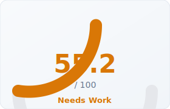
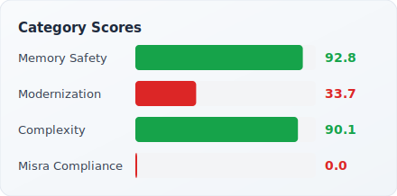

# cppulse Report: POCO C++ Libraries

> Analyzed 2026-03-26 · 640,665 LOC · 3,068 files · [Back to Leaderboard](../../README.md#analyzed-codebases)

POCO C++ Libraries is a mature, widely-deployed open-source C++ framework providing
networking, file system, threading, and cryptography primitives. With over 640K lines
of production code spanning 3,068 files and a git history stretching back nearly two
decades, it represents a realistic benchmark for cppulse: a large, actively maintained
codebase that predates modern C++ idioms.

---

## Health Score

  
  

## Category Breakdown

| Category | Score | Findings | Key Issues |
|----------|------:|--------:|------------|
| Memory Safety | **95.3** | 473 | Raw `new` (229), explicit `delete` (188), C-style arrays (56) |
| Complexity | **98.6** | 975 | High cyclomatic complexity (154), long functions (290), too many params (531) |
| Modernization | **94.7** | 13,085 | `typedef` (6,986), unscoped `enum` (3,128), C-style casts (1,081) |

**Total: 14,533 findings across 21 of 22 rules**

## Top 10 Riskiest Files

| File | Bug Probability | Risk Level | Top Factors |
|------|----------------:|:----------:|-------------|
| `ActiveRecord/testsuite/src/ActiveRecordTestSuite.cpp` | 97.9% | Critical | MISRA violations (1), 1 total findings |
| `ActiveRecord/testsuite/src/WinDriver.cpp` | 97.9% | Critical | MISRA violations (1), 1 total findings |
| `ActiveRecord/Compiler/src/CodeGenerator.cpp` | 97.2% | Critical | MISRA violations (6), modernization issues (1), 7 total findings |
| `ActiveRecord/Compiler/src/Compiler.cpp` | 97.2% | Critical | MISRA violations (4), modernization issues (1), 5 total findings |
| `ActiveRecord/Compiler/src/HeaderGenerator.cpp` | 97.2% | Critical | MISRA violations (3), modernization issues (3), 6 total findings |
| `ActiveRecord/Compiler/src/ImplGenerator.cpp` | 97.2% | Critical | MISRA violations (1), modernization issues (9), complexity (1), 11 total findings |
| `ActiveRecord/Compiler/src/Parser.cpp` | 97.2% | Critical | MISRA violations (5), 5 total findings |
| `ActiveRecord/include/Poco/ActiveRecord/Query.h` | 97.2% | Critical | MISRA violations (3), memory issues (2), 5 total findings |
| `ActiveRecord/testsuite/src/ActiveRecordTest.cpp` | 97.2% | Critical | MISRA violations (29), 29 total findings |
| `ApacheConnector/samples/FormServer/src/FormServer.cpp` | 13.5% | Low | Modernization issues (1), 3 total findings |

**38 files** flagged Critical · **13 files** flagged Low risk (of 51 total)

## Refactoring Roadmap (Top 10 by Impact)

| # | File | Action | Category | Est. Hours | Impact |
|--:|------|--------|----------|----:|------:|
| 1 | `ActiveRecord/Compiler/src/ImplGenerator.cpp` | Reduce cyclomatic complexity | complexity | 3h | 16.0 |
| 2 | `ActiveRecord/Compiler/src/ImplGenerator.cpp` | Address MISRA C++ compliance violations | misra | 2h | 16.0 |
| 3 | `Benchmark/src/BenchmarkApp.cpp` | Reduce cyclomatic complexity | complexity | 9h | 16.0 |
| 4 | `Benchmark/src/BenchmarkApp.cpp` | Address MISRA C++ compliance violations | misra | 26h | 16.0 |
| 5 | `ActiveRecord/include/Poco/ActiveRecord/Query.h` | Replace raw pointers with smart pointers | memory_safety | 8h | 16.0 |
| 6 | `ActiveRecord/include/Poco/ActiveRecord/Query.h` | Address MISRA C++ compliance violations | misra | 6h | 16.0 |
| 7 | `ActiveRecord/Compiler/src/CodeGenerator.cpp` | Address MISRA C++ compliance violations | misra | 12h | 16.0 |
| 8 | `Benchmark/src/LoggerBench.cpp` | Address MISRA C++ compliance violations | misra | 36h | 16.0 |
| 9 | `ActiveRecord/Compiler/src/Parser.cpp` | Address MISRA C++ compliance violations | misra | 10h | 16.0 |
| 10 | `ActiveRecord/Compiler/src/Compiler.cpp` | Address MISRA C++ compliance violations | misra | 8h | 16.0 |

**Total: 78 roadmap items · ~985 estimated hours**

## Downloads

- [PDF Executive Report (272 pages)](report.pdf)
- [Raw Findings (JSON)](findings.json)
- [Risk Scores (JSON)](risk_scores.json)
- [Refactoring Roadmap (JSON)](roadmap.json)
