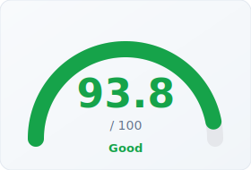
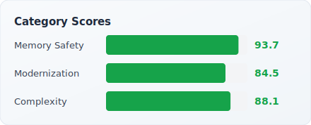

# cppulse Report: Protocol Buffers

> Analyzed 2026-03-27 · 400,000 LOC · 1,085 files · [Back to Leaderboard](../../README.md#analyzed-codebases)

Protocol Buffers (protobuf) is Google's language-neutral, platform-neutral
extensible mechanism for serializing structured data. Originally developed at
Google to replace ad hoc XML formats, it is now the backbone of gRPC and
countless internal Google systems, as well as a widely adopted standard across
the industry. At 400K lines and 1,085 analyzed files, protobuf is a large,
mature codebase. With the default profile (MISRA excluded), cppulse scores it
at 93.8/100 — a strong result driven by solid memory safety (93.7) and good
complexity control (88.1). Modernization scores 84.5, reflecting a codebase
that has progressively adopted modern C++ idioms while retaining some legacy
NULL-vs-nullptr and deprecated header patterns.

---

## Health Score

  
  

## Category Breakdown

| Category | Score | Findings | Key Issues |
|----------|------:|--------:|------------|
| Memory Safety | **93.7** | 13 | C-style array params (11), raw `new` (1), explicit `delete` (1) |
| Complexity | **88.1** | 37 | Long functions (18), high cyclomatic complexity (10), excess params (9) |
| Modernization | **84.5** | 96 | NULL vs nullptr (51), deprecated C headers (12), `auto` opportunities (12) |

**Total: 146 findings across 13 of 22 rules**

## Top 10 Riskiest Files

| File | Bug Probability | Risk Level | Top Factors |
|------|----------------:|:----------:|-------------|
| `conformance/binary_json_conformance_suite.cc` | 56.5% | Medium | Complexity findings (14), memory issues (1), 152 total findings |
| `conformance/conformance_test_runner.cc` | 31.8% | Medium | Memory issues (2), complexity findings (3), 8 total findings |
| `conformance/conformance_test_main.cc` | 27.7% | Low | Memory issues (2), complexity findings (1), 3 total findings |
| `conformance/conformance_test.cc` | 23.0% | Low | Memory issues (1), complexity findings (4), 35 total findings |
| `conformance/text_format_conformance_suite.cc` | 20.3% | Low | Memory issues (1), complexity findings (3), 20 total findings |
| `conformance/binary_json_conformance_suite.h` | 14.7% | Low | Memory issues (1), complexity findings (1), 2 total findings |
| `conformance/conformance_test.h` | 14.3% | Low | Memory issues (1), complexity findings (1), 2 total findings |
| `conformance/text_format_conformance_suite.h` | 14.3% | Low | Memory issues (1), complexity findings (1), 2 total findings |
| `bazel/private/file_concat/main.cc` | 13.2% | Low | Memory issues (1), 2 total findings |
| `hpb/extension.h` | 13.0% | Low | Memory issues (1), 1 total findings |

**2 files** flagged Medium · **29 files** flagged Low risk (of 31 total)

## Refactoring Roadmap (Top 10 by Impact)

| # | File | Action | Category | Est. Hours | Impact |
|--:|------|--------|----------|----:|------:|
| 1 | `conformance/binary_json_conformance_suite.cc` | Reduce cyclomatic complexity | complexity | 42h | 12.0 |
| 2 | `conformance/binary_json_conformance_suite.cc` | Modernize C++ code: apply C++11/14/17 idioms | modernization | 24h | 8.0 |
| 3 | `conformance/binary_json_conformance_suite.cc` | Replace raw pointers with smart pointers | memory_safety | 4h | 8.0 |
| 4 | `conformance/binary_json_conformance_suite.cc` | Address MISRA C++ compliance violations | misra | 274h | 8.0 |
| 5 | `conformance/conformance_test_runner.cc` | Replace raw pointers with smart pointers | memory_safety | 8h | 8.0 |
| 6 | `conformance/conformance_test_runner.cc` | Modernize C++ code: apply C++11/14/17 idioms | modernization | 6h | 8.0 |
| 7 | `conformance/conformance_test_runner.cc` | Reduce cyclomatic complexity | complexity | 9h | 8.0 |
| 8 | `conformance/conformance_test_runner.cc` | Address MISRA C++ compliance violations | misra | 10h | 8.0 |
| 9 | `conformance/naming_test.cc` | Address MISRA C++ compliance violations | misra | 28h | 6.0 |
| 10 | `conformance/test_manager_test.cc` | Address MISRA C++ compliance violations | misra | 14h | 6.0 |

**Total: 61 roadmap items · ~967 estimated hours**

## Downloads

- [PDF Executive Report](report.pdf)
- [Raw Findings (JSON)](findings.json)
- [Risk Scores (JSON)](risk_scores.json)
- [Refactoring Roadmap (JSON)](roadmap.json)
